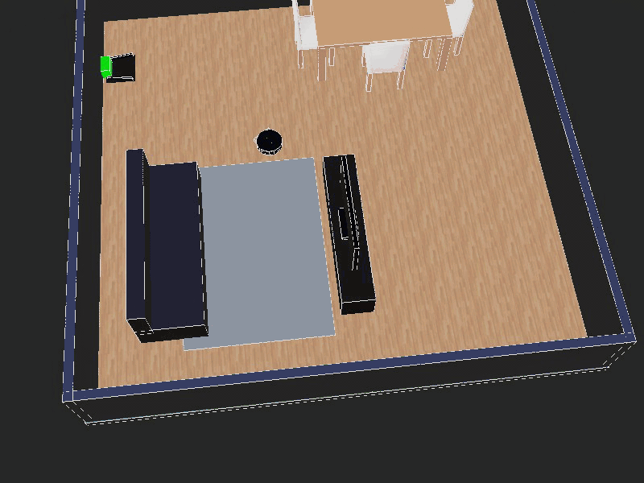
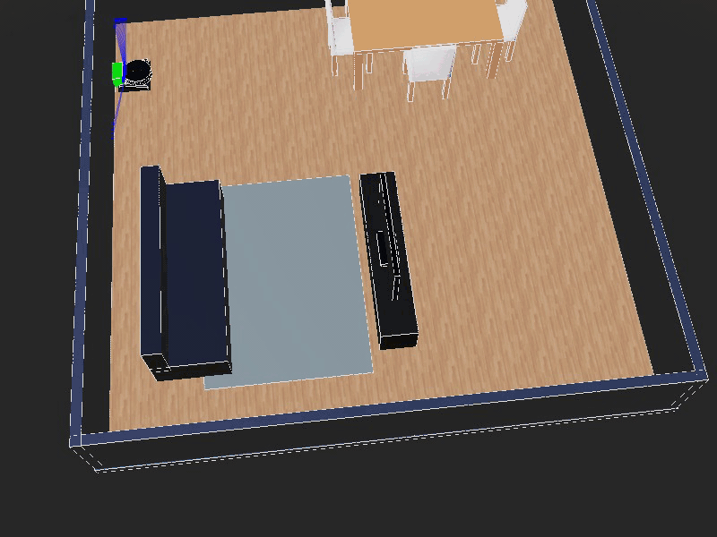

# Roomba Webots Digital Twin

Digital twin of an autonomous robotic vacuum built in Webots and Python,
featuring LiDAR navigation, carpet mapping, docking and multi-mode cleaning.

> An independently implemented simulation inspired by the iRobot Roomba 205
> DustCompactor Combo. This project is not affiliated with or endorsed by
> iRobot Corporation.

| Mission lifecycle | Controller state machine |
| --- | --- |
|  |  |

## Highlights

- Boustrophedon coverage using GPS waypoints and LiDAR-assisted navigation
- Five-sector reactive obstacle avoidance from a 256-ray, 180-degree LiDAR
- Vacuuming and carpet-aware mopping mission phases
- Persistent 0.25 m carpet grid built from downward-facing sensor readings
- Battery-aware return, PID heading alignment, docking, and charging
- Bumper, cliff, stalled-motion, waypoint, and docking recovery paths
- Editable Draw.io architecture diagrams and detailed technical documentation

## Simulation demo

### Navigation and obstacle avoidance


### Docking and undocking



### Undocking



## How it works

The controller follows a safety-first state machine. It undocks, executes the
active cleaning phase, returns to a pre-dock waypoint when the phase is complete
or the battery is low, aligns with the dock, charges, and then resumes or changes
phase.

| Cleaning priorities | Docking sequence |
| --- | --- |
|  |  |

During vacuuming, the downward-facing surface sensor populates a grid of carpet
cells. During mopping, those cells reshape the coverage path and activate a
directed escape whenever the robot reaches carpet. LiDAR obstacle reactions,
contact recovery, cliff detection, and a stalled-motion watchdog preempt normal
waypoint tracking.

See the [technical design](docs/technical-design.md) for device configuration,
state transitions, navigation thresholds, carpet logic, and docking fallbacks.

## Requirements

- Webots R2025a
- Python 3 supported by the Webots installation

The controller relies only on Python's standard library and the Webots
`controller` module supplied by Webots. No separate package installation is
required.

## Run the simulation

1. Clone the repository and enter its directory:

   ```bash
   git clone <repository-url>
   cd roomba-webots-digital-twin
   ```

2. Start Webots with the included world:

   ```bash
   webots worlds/project.wbt
   ```

   On systems where the `webots` command is not on `PATH`, open Webots and
   select **File > Open World**, then choose `worlds/project.wbt`.

3. Press **Play**. The world assigns `roomba_controller` to the robot, so Webots
   starts `controllers/roomba_controller/roomba_controller.py` automatically.

4. Follow state, navigation, battery, and watchdog events in the Webots console.

## Project structure

```text
.
├── controllers/
│   └── roomba_controller/
│       └── roomba_controller.py
├── docs/
│   ├── assets/
│   ├── diagrams/
│   │   ├── draw.io/
│   │   └── images/
│   └── technical-design.md
├── worlds/
│   └── project.wbt
├── LICENSE
└── README.md
```

## Design boundaries

- GPS provides ground-truth position inside the simulation; this is a digital
  twin control prototype, not a deployable localization stack.
- Carpet mapping is held in memory for the current simulation run.
- The controller uses fixed fallback room and rug bounds when passive mapping has
  insufficient observations.
- Behavior depends on the device geometry and names defined in
  `worlds/project.wbt`.

## License

Original code and documentation in this repository are available under the
[MIT License](LICENSE). iRobot, Roomba, ClearView, and DustCompactor are marks of
their respective owner and are referenced for identification only.
