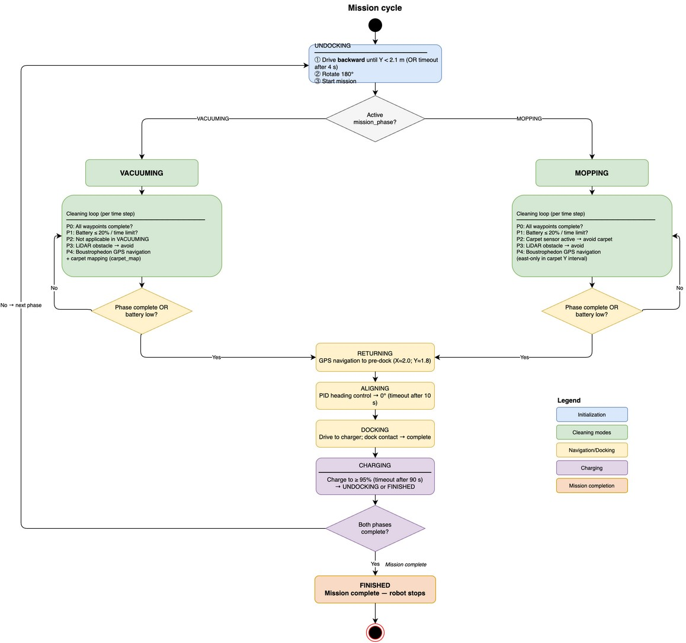
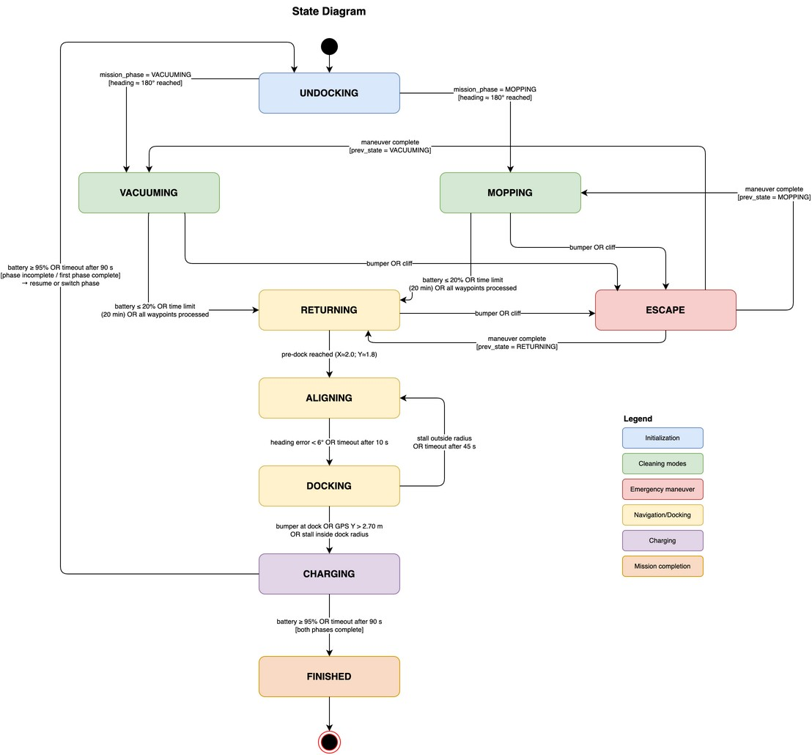
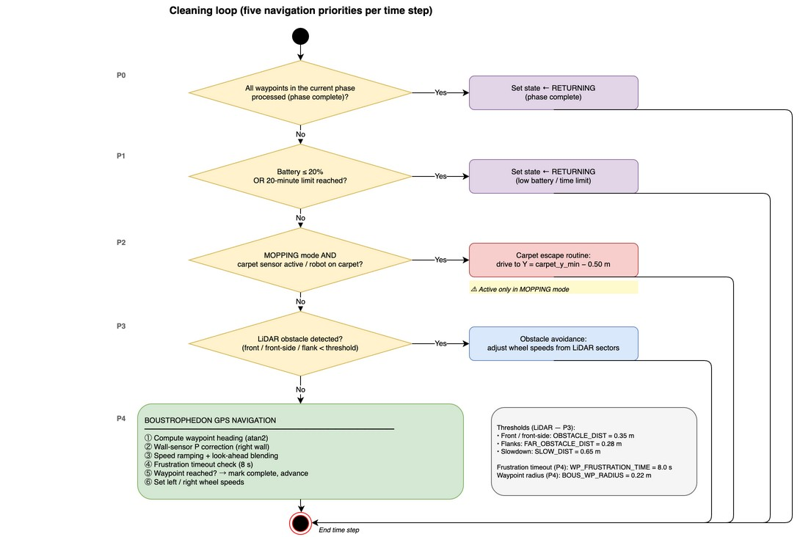

# Technical Design

## System overview

This repository models an autonomous vacuum-and-mop robot in Webots R2025a. The
simulation combines deterministic coverage planning with reactive safety logic,
carpet mapping, battery-aware mission control, and autonomous docking. The
controller is implemented in Python and uses only Webots devices declared in the
world file.





## Simulation environment

The `worlds/project.wbt` scene is a 6 m by 6 m rectangular room. It contains a
home base, a rug, a sofa, a television cabinet, a dining table, and four chairs.
The robot starts at `(2.00, 2.60, 0.075)` near the home base at
`(2.00, 2.85)`.

| Element | World coordinates | Dimensions |
| --- | --- | --- |
| Home base | X = 2.00 m, Y = 2.85 m | Custom Webots `Charger` node |
| Pre-dock target | X = 2.00 m, Y = 1.80 m | Controller waypoint |
| Rug center | X = -1.00 m, Y = 1.00 m | 2.5 m by 1.8 m |
| Rug bounds | X = -2.25 to 0.30 m; Y = 0.05 to 1.95 m | Controller fallback bounds |

## Robot model

The simulated robot is a custom differential-drive platform with a cylindrical
body, two driven wheels, and a passive caster. Its configured mass is 3.5 kg.

### Sensors

| Device | Webots type | Configuration and role |
| --- | --- | --- |
| `clearview_lidar` | `Lidar` | 256 horizontal rays, 180-degree field of view, one layer; obstacle detection and passive wall-point collection |
| `bumper` | `TouchSensor` | Front contact detection |
| `wall_sensor` | `DistanceSensor` | Right-side distance input used for heading correction |
| `carpet_sensor` | `DistanceSensor` | Downward-facing surface input used to map and avoid the rug |
| Four `cliff_sensor_*` devices | `DistanceSensor` | Downward-facing edge detection |
| `gps` | `GPS` | World-frame position for coverage and docking |
| `compass` | `Compass` | Heading estimate for navigation and docking alignment |
| Battery sensor | Robot battery API | Return-to-dock and charging decisions |

The LiDAR range image is split into five sectors:

| Sector | Indices | Direction |
| --- | ---: | --- |
| Far left | 0-63 | Left flank |
| Front left | 64-111 | Left-front |
| Front | 112-143 | Straight ahead |
| Front right | 144-191 | Right-front |
| Far right | 192-255 | Right flank |

### Actuators and indicators

The `motor_left` and `motor_right` rotational motors are velocity-controlled and
bounded by `MAX_SPEED` (6.28 rad/s). Two LEDs expose controller state. Their
patterns are defined in `_set_leds`; both LEDs are also used to indicate the
mopping, returning, and finished states.

## Controller architecture

The controller executes one sensing-and-control cycle per Webots basic time
step:

1. Run the cycle-time watchdog.
2. Read battery, proximity, surface, position, and heading inputs.
3. Check contact and cliff emergencies.
4. Check whether the robot is making positional progress.
5. Execute the active state.

The state machine contains nine states:

| State | Responsibility |
| --- | --- |
| `UNDOCKING` | Reverse away from the charger, rotate to 180 degrees, and resume the next unvisited waypoint |
| `VACUUMING` | Follow the coverage path while allowing and mapping carpet |
| `MOPPING` | Follow carpet-aware coverage paths and actively leave detected carpet |
| `ESCAPE` | Reverse and rotate after contact, cliff detection, or lack of progress |
| `RETURNING` | Navigate to the pre-dock target, optionally through a bypass waypoint |
| `ALIGNING` | Align to 0 degrees with the bounded PID controller |
| `DOCKING` | Approach the charger with GPS X and heading corrections |
| `CHARGING` | Hold position until 95 percent charge or the charging timeout |
| `FINISHED` | Stop after both cleaning phases complete |




## Coverage and obstacle avoidance

The controller generates a boustrophedon path across the configured room bounds.
Adjacent strips are 0.35 m apart and alternate direction. A waypoint is complete
within a radius of 0.22 m. Look-ahead blending begins within 0.55 m of the active
waypoint, and wheel speed ramps toward the configured cruise speed.

Reactive obstacle avoidance takes priority over waypoint following. The front
and front-corner sectors use a 0.35 m trigger, the flank sectors use 0.28 m, and
the robot slows when the forward range is below 0.65 m. A waypoint that shows no
meaningful progress for eight seconds while nearby is marked as skipped so the
mission can continue.

During vacuuming, valid LiDAR samples are periodically transformed into world
coordinates. Once enough points have been collected, the 5th and 95th
percentiles estimate room limits with a 0.30 m safety margin. The default bounds
remain active if the estimate is too small or insufficient samples are available.

## Carpet-aware cleaning

During `VACUUMING`, readings above `CARPET_FULL` (730) are stored in a set of
0.25 m grid cells. The resulting map determines the carpet Y interval and eastern
edge used to generate the `MOPPING` path. If no cells have been mapped, the
controller uses the fallback rug bounds declared in its constants.

During `MOPPING`, the generated strips cover the full room outside the carpet Y
interval and only the area east of the mapped carpet inside that interval. A
sensor reading above `CARPET_FULL`, or above `CARPET_EDGE` (670) near the known
rug area, starts a directed escape toward a point south of the carpet boundary.

## Docking and charging

The controller enters `RETURNING` below 20 percent battery, after 1,200 seconds
in a cleaning phase, or after all phase waypoints are processed. A robot returning
from the southern portion of the room first targets `(0.50, 0.50)` to avoid the
dining area, then proceeds to `(2.00, 1.80)`.

At the pre-dock point, the PID controller aligns the robot to 0 degrees with
`Kp = 0.045`, `Ki = 0`, and `Kd = 0.001`. Docking then combines lateral GPS
correction with heading correction. Contact near the dock, Y position beyond
2.70 m, or a stall beyond Y = 2.45 m confirms docking. A stall outside that area
or a 45-second timeout returns the controller to alignment.

The Webots charger and robot batteries are both configured as
`[10000, 10000, 1000]`. The controller leaves `CHARGING` at 95 percent or after
90 seconds. It resumes an incomplete phase, switches phases after a completed
phase, and enters `FINISHED` once vacuuming and mopping are complete.

## Safety and resilience

- Bumper and cliff inputs preempt cleaning and returning with an `ESCAPE` state.
- Repeated evasions select a longer 180-degree turn for corner recovery.
- A positional watchdog triggers escape after less than 0.05 m movement over
  10 seconds in a cleaning state.
- A cycle watchdog logs controller intervals above 150 ms.
- Motor commands are always clamped to the configured maximum wheel speed.
- Docking uses alignment, stall, position, and timeout fallbacks.

## Source layout

```text
controllers/roomba_controller/roomba_controller.py  Controller implementation
docs/diagrams/draw.io/                              Editable diagram sources
docs/diagrams/images/                               Exported diagrams
docs/technical-design.md                            This document
worlds/project.wbt                                  Webots robot and environment
```

## Scope and attribution

This repository contains an independently implemented simulation model. Product
and feature names are used only to identify the physical system that inspired
the digital twin. No manufacturer manual, firmware, or proprietary product
imagery is distributed with the project.
