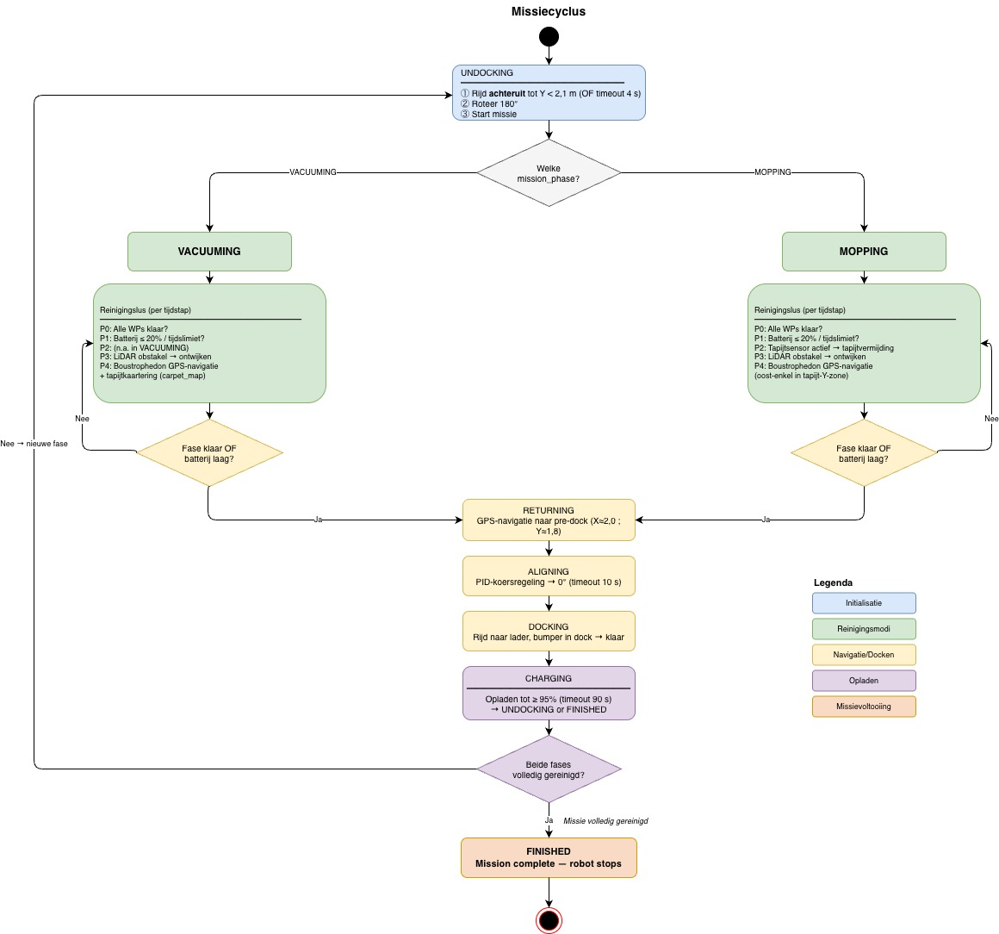
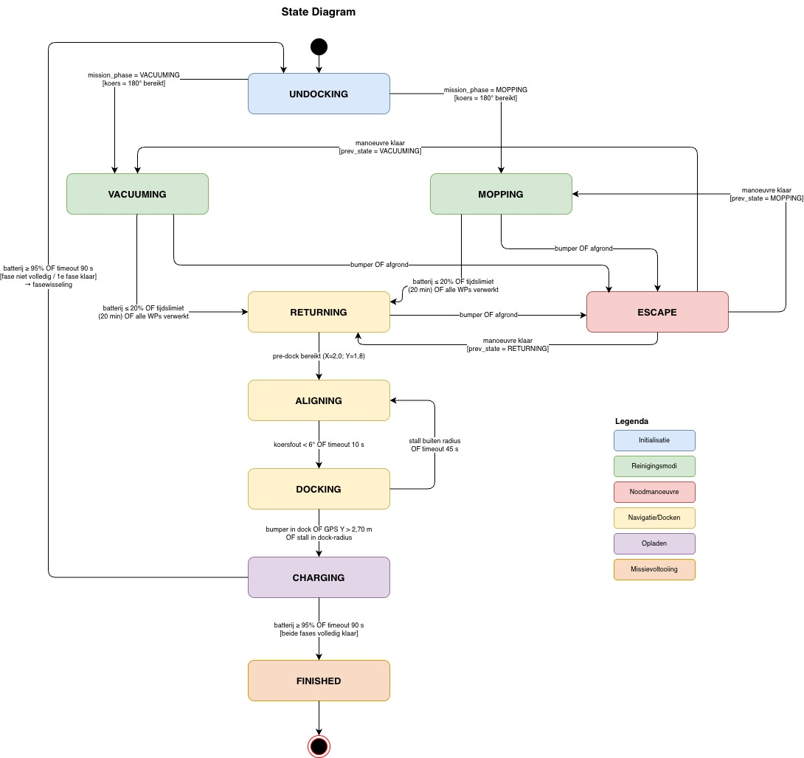
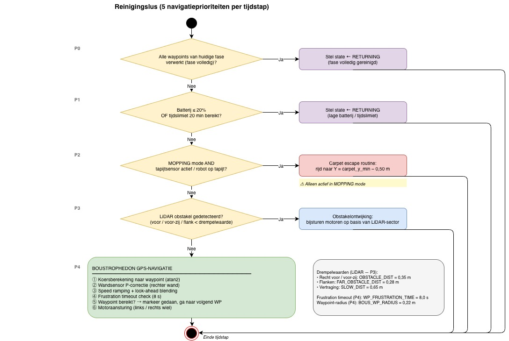
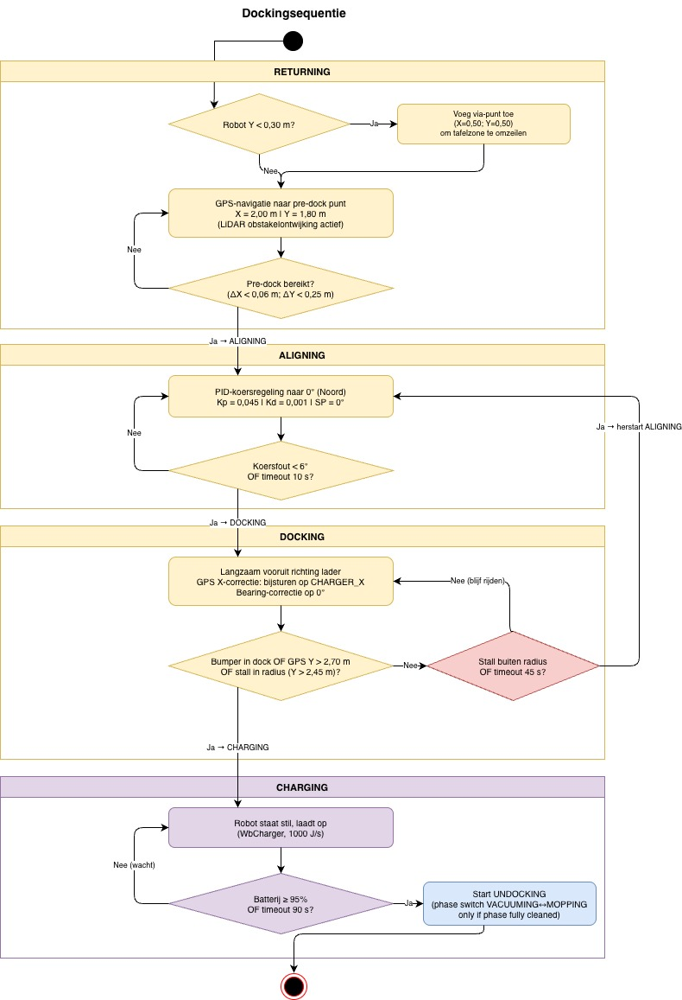

# Technisch Constructiedossier

## iRobot Roomba® 205 DustCompactor™ Combo — Webots Digital Twin

**Auteur:** Ian Mondelaers  
**Simulatieomgeving:** Webots R2025a  
**Datum:** 29/05/2026

---

## Inhoudsopgave

1. [Productomschrijving](#1-productomschrijving)
2. [Digitale twin — simulatieomgeving](#2-digitale-twin--simulatieomgeving)
3. [Sensoren](#3-sensoren)
4. [Actuatoren](#4-actuatoren)
5. [State machine](#5-state-machine)
6. [Navigatiestrategie](#6-navigatiestrategie)
7. [Reinigingsmodi](#7-reinigingsmodi)
8. [Tapijtkaartering](#8-tapijtkaartering)
9. [PID-regelaar](#9-pid-regelaar)
10. [Batterijbeheer en laadstation](#10-batterijbeheer-en-laadstation)
11. [LED-signalering](#11-led-signalering)
12. [Veiligheids- en bewakingsfuncties](#12-veiligheids--en-bewakingsfuncties)
13. [Softwarestructuur](#13-softwarestructuur)
14. [Diagrammen](#14-diagrammen)
15. [Handleiding](#15-handleiding)

---

## 1. Productomschrijving

### 1.1 Specificaties werkelijk toestel

| Eigenschap    | Waarde                                                                     |
| ------------- | -------------------------------------------------------------------------- |
| Producent     | iRobot                                                                     |
| Model         | Roomba® 205 DustCompactor™ Combo                                           |
| Functies      | Stofzuigen en dweilen (twee verwisselbare modi)                            |
| Navigatie     | ClearView™ LiDAR — rijdt in rechte banen, wand-tot-wand, ook in het donker |
| Batterij      | Lithium-ion, oplaadbaar via thuisstation                                   |
| Thuisstation  | Automatische terugkeer en docken bij laag batterijvermogen                 |
| Productpagina | https://www.irobot.be/nl_BE/roomba-205-dustcompactor-combo/L121240.html    |

De Roomba® 205 is een autonoom reinigingstoestel dat dankzij ClearView™ LiDAR-technologie een ruimte systematisch in rechte banen afdekt, in tegenstelling tot oudere modellen die willekeurig rondreden. Het toestel wisselt zelfstandig van reinigingsmodus (stofzuigen of dweilen) en keert terug naar het thuisstation voor het opladen.

---

## 2. Digitale twin — simulatieomgeving

### 2.1 Wereld

De simulatie speelt zich af in een gesloten kamer van ongeveer 5,9 × 5,9 m met vier muren. De kamer bevat een aantal obstakels (meubels: sofa, tafel) die de robot reactief moet omzeilen. In de noordoostelijke hoek bevindt zich het laadstation.

| Element              | Positie (wereldcoördinaten) | Afmetingen            |
| -------------------- | --------------------------- | --------------------- |
| Laadstation          | X = 2,00 m, Y = 2,85 m      | —                     |
| Pre-dock punt        | X = 2,00 m, Y = 1,80 m      | —                     |
| Tapijt (middel­punt) | X = −1,00 m, Y = 1,00 m     | 2,5 m × 1,8 m (X × Y) |
| Tapijt X-grenzen     | −2,25 m tot +0,30 m         | —                     |
| Tapijt Y-grenzen     | +0,05 m tot +1,95 m         | —                     |

### 2.2 Coördinatenstelsel

In de Webots-wereld geldt:

- **+Y-as** = Noord (richting laadstation)
- **+X-as** = Oost
- **Kompashoek 0°** = Noord (richting +Y), **90°** = Oost (richting +X)

### 2.3 Startpositie

De robot start op het laadstation (X = 2,00 m, Y = 2,60 m) en rijdt bij het opstarten achteruit weg (UNDOCKING) alvorens de eerste reinigingsfase te starten.

---

## 3. Sensoren

De digitale twin is uitgerust met dezelfde sensorklassen als het werkelijke toestel. Hieronder volgt een overzicht van elke sensor, zijn positie op de robot en zijn functie in de controller.

### 3.1 ClearView™ LiDAR

| Eigenschap             | Waarde                                          |
| ---------------------- | ----------------------------------------------- |
| Type                   | 2D roterende LiDAR (afstandssensor, één laag)   |
| Positionering          | Vooraan op de robot, gecentreerd, iets verhoogd |
| Afstand tot middelpunt | 15 cm naar voren                                |
| Horizontale resolutie  | 256 meetstralen                                 |
| Gezichtsveld (FOV)     | 180° (halve cirkel naar voor)                   |
| Sectorindeling         | Zie onderstaande tabel                          |

**Sectorindeling (ray-indices):**

| Sector      | Indices   | Richting           |
| ----------- | --------- | ------------------ |
| Ver links   | 0 – 63    | Linker flank       |
| Voor-links  | 64 – 111  | Schuin voor-links  |
| Recht voor  | 112 – 143 | Rechtstreeks voor  |
| Voor-rechts | 144 – 191 | Schuin voor-rechts |
| Ver rechts  | 192 – 255 | Rechter flank      |

De LiDAR wordt gebruikt voor reactieve obstakeldetectie. Per sector wordt de minimale gemeten afstand bepaald. Bij overschrijding van drempelwaarden (OBSTACLE_DIST = 0,35 m voor voor-sectoren, FAR_OBSTACLE_DIST = 0,28 m voor flankensectoren) stuurt de controller de motoren bij om het obstakel te omzeilen. Traag naderen (SLOW_DIST = 0,65 m) wordt ook afgehandeld.

### 3.2 Bumpersensor

| Eigenschap             | Waarde                                   |
| ---------------------- | ---------------------------------------- |
| Type                   | Contactsensor (TouchSensor)              |
| Positionering          | Vooraan op de robot, gecentreerd         |
| Afstand tot middelpunt | 12 cm naar voren                         |
| Functie                | Noodstop bij fysiek contact met obstakel |

Bij een bumper­hit schakelt de controller over naar de ESCAPE-state, ongeacht de huidige reinigingsstate.

### 3.3 Wandsensor

| Eigenschap             | Waarde                                              |
| ---------------------- | --------------------------------------------------- |
| Type                   | IR-afstandssensor (DistanceSensor)                  |
| Positionering          | Rechterzijkant van de robot                         |
| Afstand tot middelpunt | 16 cm naar rechts                                   |
| Meetbereik             | 0 – 0,2 m (lookupTable: 0 m → 1000, 0,2 m → 0)      |
| Functie                | Zachte koerscorrectie bij rijden langs rechter wand |

De sensorwaarde wordt gebruikt voor een proportionele correctieterm (P-correctie) tijdens de boustrophedon-navigatie. Dit verbetert de rechtheid van de banen langs de wanden.

### 3.4 Tapijtsensor

| Eigenschap             | Waarde                                                                  |
| ---------------------- | ----------------------------------------------------------------------- |
| Type                   | IR-afstandssensor, omlaag gericht (DistanceSensor)                      |
| Positionering          | Vooraan op de robot, gecentreerd, omlaag gericht                        |
| Afstand tot middelpunt | 16 cm naar voren                                                        |
| Meetbereik             | 0 – 0,1 m (lookupTable: 0 m → 1000, 0,1 m → 0)                          |
| Drempelwaarden         | CARPET_FULL > 730 — volledig op tapijt, CARPET_EDGE > 670 — tapijt­rand |

De tapijtsensor onderscheidt vloer van tapijt op basis van reflectiewaarden. Tijdens **VACUUMING** worden positieve metingen (> CARPET_FULL) gebruikt om een persistente tapijt­gridkaart op te bouwen. Tijdens **MOPPING** triggert een positieve meting de tapijtvermijdings­routine.

### 3.5 Klifdetectoren (4×)

| Sensor                   | Positionering                                    |
| ------------------------ | ------------------------------------------------ |
| cliff_sensor_left        | Vooraan links (12 cm voor, 8 cm links), omlaag   |
| cliff_sensor_right       | Vooraan rechts (12 cm voor, 8 cm rechts), omlaag |
| cliff_sensor_front_left  | Linkerzijkant (3 cm voor, 15 cm links), omlaag   |
| cliff_sensor_front_right | Rechterzijkant (3 cm voor, 15 cm rechts), omlaag |

Alle vier de klifdetectoren zijn naar beneden gericht. Bij een meting onder 100 (afgrond gedetecteerd) schakelt de controller onmiddellijk over naar ESCAPE. Dit simuleert de werkelijke valbeveiliging van de Roomba.

### 3.6 GPS

| Eigenschap    | Waarde                                      |
| ------------- | ------------------------------------------- |
| Positionering | Centraal in de robot                        |
| Functie       | Positiebepaling in wereldcoördinaten (X, Y) |

De GPS levert nauwkeurige X/Y-coördinaten en vormt de kern van de boustrophedon-navigatie, de terugkeer­route naar het laadstation en de tapijt­zonevalidatie.

### 3.7 Kompas

| Eigenschap    | Waarde                                  |
| ------------- | --------------------------------------- |
| Positionering | Centraal in de robot                    |
| Functie       | Rijrichting (bearing) bepalen in graden |

De rijrichting wordt berekend als:

```
bearing = atan2(compass[1], compass[0])  [radialen → graden]
0° = Noord (+Y), 90° = Oost (+X)
```

Het kompas wordt gebruikt bij de PID-koersregeling in ALIGNING, bij de UNDOCKING-draaibeweging en bij de koersberekening naar waypoints.

---

## 4. Actuatoren

### 4.1 Aandrijving — differentieel wiel­stelsel

De robot beschikt over twee aangedreven wielen en één passief steunwiel:

| Component    | Positionering                          |
| ------------ | -------------------------------------- |
| Linker wiel  | Linkerzijkant, 11,5 cm van het midden  |
| Rechter wiel | Rechterzijkant, 11,5 cm van het midden |
| Steunwiel    | Vooraan, gecentreerd (passief)         |

De wielen worden aangestuurd via `setVelocity()` in rad/s. De maximumsnelheid is **MAX_SPEED = 6,28 rad/s**. Door de wielen met verschillende snelheden aan te sturen, kan de robot draaien of een bocht maken. Gelijke snelheden geven een rechte lijn.

### 4.2 Status-LED

| Eigenschap    | Waarde                                                 |
| ------------- | ------------------------------------------------------ |
| Positionering | Bovenzijde, vooraan (5 cm voor het midden)             |
| Kleur         | Wit                                                    |
| Functie       | Visualisatie van actieve reinigings- of navigatiestate |

### 4.3 Batterij-LED

| Eigenschap    | Waarde                                         |
| ------------- | ---------------------------------------------- |
| Positionering | Bovenzijde, achteraan (5 cm achter het midden) |
| Kleur         | Rood                                           |
| Functie       | Signalering van lage batterij                  |

---

## 5. State machine

De controller implementeert een **acht-toestandsmachine**. Elke state heeft een welomschreven activiteiten­set en overgangsvoorwaarden.

### 5.1 Overzicht van alle states

| State     | Beschrijving                                                                |
| --------- | --------------------------------------------------------------------------- |
| UNDOCKING | Robot rijdt achteruit weg van laadstation en draait naar reinigingsrichting |
| VACUUMING | Systematisch stofzuigen via boustrophedon-navigatie, tapijt toegestaan      |
| MOPPING   | Systematisch dweilen via boustrophedon-navigatie, tapijt verboden           |
| ESCAPE    | Noodmanoeuvre na bumper­hit of afgronddetectie                              |
| RETURNING | GPS-gestuurde terugkeer naar de pre-dock positie                            |
| ALIGNING  | PID-gestuurde uitlijning op 0° (Noord) voor het docken (Kp=0,045, Kd=0,001) |
| DOCKING   | Langzaam insturen van het laadstation op basis van GPS X-correctie          |
| CHARGING  | Stilstaand opladen, fasewisseling bij volledig opgeladen batterij           |
| FINISHED  | Eindstate: VACUUMING + MOPPING beide volledig afgerond; robot staat stil    |

### 5.2 Transitieoverzicht

**UNDOCKING:**

- Fase 1 (REVERSE): robot rijdt achteruit tot Y < 2,1 m of na 4 s
- Fase 2 (TURN): robot draait naar 180° (rijrichting kamer in)
- → Overgaat naar `mission_phase` (VACUUMING of MOPPING)

**VACUUMING / MOPPING:**

- → RETURNING als batterij ≤ 20% of tijdslimiet (20 min) overschreden
- → RETURNING als alle waypoints van de huidige fase verwerkt zijn
- → ESCAPE bij bumper­hit of afgronddetectie

**ESCAPE:**

- Fase 1: achteruit rijden (~1 s)
- Fase 2: draaien (willekeurige richting, 0,8 – 1,6 s, bij hoeksituatie 180°)
- → Terug naar vorige state (VACUUMING, MOPPING of RETURNING)

**RETURNING:**

- GPS-navigatie naar pre-dock punt (X = 2,00, Y = 1,80)
- Indien robot diep in de kamer zit (Y < 0,30): eerst tussentijds via-punt
- → ALIGNING als pre-dock punt bereikt

**ALIGNING:**

- PID-koersregeling naar kompas­bearing 0° (Noord): Kp = 0,045 | Ki = 0,0 | Kd = 0,001
- → DOCKING als |afwijking| < 6° of na time-out van 10 s

**DOCKING:**

- Robot rijdt langzaam vooruit richting laadstation
- GPS X-correctie: `x_err = CHARGER_X − pos[0]` → bijsturen
- → CHARGING bij bumper­hit in dock (Y > 2,55 m) of GPS­bevestiging (Y > 2,70 m)
- → ALIGNING bij stall of time-out

**CHARGING:**

- Robot staat stil en laadt op
- Fasewisseling bij ≥ 95% geladen of na 90 s time-out
- Als huidige fase volledig is én beide fases al afgerond: → FINISHED
- Als huidige fase volledig is maar andere fase nog niet: wisselen VACUUMING ↔ MOPPING → UNDOCKING
- Als fase nog niet volledig is: zelfde fase hervatten → UNDOCKING

**FINISHED:**

- Robot staat stil; beide LEDs branden als bevestigingssignaal
- Eindstate: geen verdere overgangen

### 5.3 Persistente missiecyclus

De `wp_done`-sets (één per fase) registreren welke waypoints al verwerkt zijn. Deze sets overleven laadcycli, zodat de robot na het opladen **verdergaat** waar hij gebleven was — dit gedrag weerspiegelt de werkelijke Roomba® met geheugen.

---

## 6. Navigatiestrategie

### 6.1 Boustrophedon-navigatie (ClearView™ LiDAR stijl)

De robot reinigt de kamer in **rechte, zigzaggendende banen** — ook wel boustrophedon­navigatie genoemd. Dit is het navigationsprincipe dat de werkelijke Roomba® 205 ook toepast met ClearView™ LiDAR: "navigates in neat rows, wall-to-wall" (bron: irobot.com).

Waypoints worden vooraf gegenereerd op een uniform raster:

- **Stripafstand:** 0,35 m (BOUS_STRIP_STEP)
- **X-bereik:** −2,35 m tot +2,35 m (BOUS_X_MIN / BOUS_X_MAX)
- **Y-bereik:** −2,10 m tot +1,80 m (BOUS_Y_MIN / BOUS_Y_MAX)
- **Waypoint­radius:** 0,22 m — een waypoint geldt als bereikt als de robot er binnen 0,22 m van verwijderd is

De richting wisselt per strook: oost → west → oost → ... De robot rijdt van waypoint naar waypoint via GPS-navigatie. Een waypoint­paar vormt één strook.

### 6.2 Navigatieprioriteiten in de reinigingslus

De rijlogica is opgebouwd als een gelaagd prioriteitssysteem (hoogste prioriteit eerst):

| Prioriteit | Omschrijving                                                      |
| ---------- | ----------------------------------------------------------------- |
| 0          | Fase volledig afgerond → onmiddellijk naar RETURNING              |
| 1          | Batterij laag of tijdslimiet → naar RETURNING                     |
| 2          | Tapijtvermijding (alleen MOPPING) via sensor­escape               |
| 3          | LiDAR-obstakelontwijking (reactief, altijd actief)                |
| 4          | Boustrophedon GPS-navigatie met frustration-timeout en look-ahead |

### 6.3 Waypoint frustration-timeout

Als de robot zich binnen 1,5 m van een waypoint bevindt maar langer dan 8 s geen meetbare vooruitgang maakt (< 4 cm dichter), wordt het waypoint als "geblokkeerd" beschouwd en overgeslagen. Dit mechanisme vervangt alle hardcoded meubelzones: obstakels worden dynamisch afgehandeld.

### 6.4 Look-ahead en speed ramping

Vlak voor een waypoint (< 0,55 m) mengt de controller de stuursignalen met de richting naar het **volgende** waypoint. Dit geeft vloeiendere bochten. De rijsnelheid wordt gradueel opgebouwd (SPEED_RAMP = 5,0 rad/s²) en wordt teruggeschroefd bij obstakeldetectie.

### 6.5 Terugkeer en docking

Bij terugkeer naar het laadstation navigeert de robot in twee fasen:

1. **RETURNING:** GPS-sturing naar pre-dock punt (X = 2,00, Y = 1,80). Bij een startpositie zuidelijk in de kamer (Y < 0,30) wordt een tussentijds via-punt (X = 0,50, Y = 0,50) ingezet om te vermijden dat de robot recht door de tafelzone rijdt.
2. **ALIGNING + DOCKING:** PID-uitlijning op Noord (0°), gevolgd door langzaam insturen met GPS X-correctie.

---

## 7. Reinigingsmodi

### 7.1 VACUUMING

- Tapijt is **toegestaan**: de robot rijdt zowel over de vloer als over het tapijt
- De tapijtsensor registreert tapijt­cellen en voegt deze toe aan de persistente **tapijt­gridkaart**
- Dezelfde boustrophedon-waypoints als MOPPING (volledige kamer­breedte)
- Status-LED aan, batterij-LED uit

### 7.2 MOPPING

- Tapijt is **verboden**: de dweil mag niet nat worden
- Aparte MOPPING-waypoints worden gegenereerd via `_generate_mopping_waypoints()`:
  - Stroken ten **zuiden** van het tapijt (Y < tapijt­min − 0,20 m): volledige breedte
  - Stroken in de **tapijt-Y-zone**: alleen het oost­gedeelte (X ≥ ca. 0,70 m), zodat de vloer rechts van het tapijt toch gedweild wordt zonder het tapijt zelf te betreden
- Sensor­gebaseerde tapijtvermijding (zie §8) als extra veiligheidslaag
- Status-LED en batterij-LED beide aan

### 7.3 Fasewisseling

Na elke volledige reinigingsfase wisselt de robot van modus: VACUUMING → MOPPING → VACUUMING → ... De wisseling vindt plaats in de CHARGING-state, nadat alle waypoints van de huidige fase verwerkt zijn.

---

## 8. Tapijtkaartering

### 8.1 Opbouw van de tapijt­gridkaart

Tijdens VACUUMING bouwt de robot een persistente **tapijt­gridkaart** op (set van gridcel-indices). Wanneer de tapijtsensor boven de CARPET_FULL-drempel (730) uitkomt, wordt de sensorpositie omgezet naar een gridcel:

```
sensorpositie = robotpositie + 0,16 m × rijrichting (vooraan)
gridcel (cx, cy) = int(sensorpositie / CARPET_CELL_SIZE)   [CARPET_CELL_SIZE = 0,25 m]
```

Enkel nieuwe cellen worden toegevoegd (geen duplicaten). De kaart overleeft laadcycli.

### 8.2 Gebruik in MOPPING

De tapijt­gridkaart levert:

- **`_min_carpet_y()` / `_max_carpet_y()`:** dynamische Y-grenzen van het tapijt (in meters)
- **`_carpet_x_east()`:** oostgrens van het tapijt + veiligheidsbuffer → startpunt voor oost­stroken in MOPPING

### 8.3 Sensor­gebaseerde tapijtvermijding

Als de tapijtsensor tijdens MOPPING boven de drempel uitkomt (of als GPS aangeeft dat de robot op het tapijt staat), activeert de **carpet escape routine**:

1. De robot rijdt naar een doelpunt op `carpet_y_min − 0,50 m` (ten zuiden van het tapijt)
2. De escape wordt beëindigd zodra de sensor onder de drempel valt EN GPS bevestigt dat de robot buiten het tapijt is

---

## 9. PID-regelaar

De PID-regelaar is geïmplementeerd conform het design specification. De klasse `PID_Controller` mag niet worden gewijzigd.

### 9.1 Formules

```
ER  = SP − PV                          (regelverschil)
P   = Kp × ER                          (proportioneel)
I   = Ki × ∫ER dt                      (integrerend)
D   = Kd × (ER − prev_ER) / Δt        (differentiërend)
LMN = clamp(P + I + D, LMN_LLM, LMN_HLM)
```

### 9.2 Toepassing in de controller

De PID-regelaar wordt actief gebruikt voor **koersregeling in de ALIGNING-state**. Het object `pid_bearing` wordt aangemaakt met de volgende parameters en gereset bij elke overgang naar ALIGNING:

| Parameter | Waarde            | Betekenis                                     |
| --------- | ----------------- | --------------------------------------------- |
| Kp        | 0,045             | Proportionele gain (koersfout → sturing)      |
| Ki        | 0,0               | Integrerende gain (uitgeschakeld)             |
| Kd        | 0,001             | Differentiërende gain (demping bij overshoot) |
| SP        | 0,0°              | Gewenste koers: Noord (0°)                    |
| LMN_HLM   | +0,45 × MAX_SPEED | Maximale rechtse sturing                      |
| LMN_LLM   | −0,45 × MAX_SPEED | Maximale linkse sturing                       |

Per tijdstap wordt de PID-uitgang berekend op basis van de actuele koersfout:

```python
err = angle_error(0.0, self.bearing)          # kortste hoekafstand naar Noord
lmn = self.pid_bearing.compute(-err, self.dt) # LMN: positief = CW, negatief = CCW
turn_sp = clamp(abs(lmn), 0.02 * MAX_SPEED, 0.45 * MAX_SPEED)
```

De PV wordt als `-err` doorgegeven zodat ER = SP − PV = 0 − (−err) = err, wat een positieve LMN-uitgang geeft bij een positieve koersfout (robot moet CW draaien). De LMN-magnitude wordt als symmetrische in-place draaisnelheid toegepast: `left = ±turn_sp, right = ∓turn_sp`.

---

## 10. Batterijbeheer en laadstation

### 10.1 Batterijparameters

| Parameter          | Waarde                | Beschrijving                                |
| ------------------ | --------------------- | ------------------------------------------- |
| Maximumcapaciteit  | 10.000 J              | Volledig geladen                            |
| Terugkeerdrempel   | 20% (2.000 J)         | Onder deze grens → RETURNING                |
| Laadtijd           | Max. 90 s (simulatie) | Time-out bij onvolledig laden               |
| Drempel "volledig" | 95%                   | Boven deze grens → UNDOCKING starten        |
| Laadvermogen       | 1.000 J/s             | Zoals ingesteld in de Webots WbCharger-node |

### 10.2 Laadlogica

De Webots `WbCharger`-node vereist een `battery`-veld met drie waarden: `[capaciteit, huidig, vermogen]`. Zonder het derde element (vermogen) wordt het laden volledig overgeslagen. De robot laadt passief op zodra hij in de laadzone staat (CHARGING-state).

### 10.3 Dockinggeometrie

| Punt             | X (m) | Y (m) | Beschrijving                            |
| ---------------- | ----- | ----- | --------------------------------------- |
| Laadstation      | 2,00  | 2,85  | Fysieke laaderpositie                   |
| Pre-dock         | 2,00  | 1,80  | Doel van RETURNING-navigatie            |
| Dock arm         | 2,00  | 2,55  | Minimale Y voor "in dock" via bumper    |
| Dock bevestiging | 2,00  | 2,70  | GPS-bevestiging van volledige dock      |
| Stall radius     | 2,00  | 2,45  | Minimale Y voor nood­charging bij stall |

---

## 11. LED-signalering

| State     | Status-LED | Batterij-LED | Betekenis                                |
| --------- | :--------: | :----------: | ---------------------------------------- |
| UNDOCKING |    AAN     |     UIT      | Robot verlaat laadstation                |
| VACUUMING |    AAN     |     UIT      | Actief stofzuigen                        |
| MOPPING   |    AAN     |     AAN      | Actief dweilen (beide LEDs = dweilmodus) |
| ESCAPE    |    UIT     |     UIT      | Noodmanoeuvre                            |
| RETURNING |    AAN     |     AAN      | Terugkeer naar laadstation               |
| ALIGNING  |    AAN     |     UIT      | Uitlijnen voor docken                    |
| DOCKING   |    AAN     |     UIT      | Insturen laadstation                     |
| CHARGING  |    UIT     |     UIT      | Stilstaand opladen                       |
| FINISHED  |    AAN     |     AAN      | Missie volledig afgerond                 |

Aanvullend: bij een batterijpercentage ≤ 20% buiten CHARGING/DOCKING knippert de batterij-LED aan (rode waarschuwing), ongeacht de state.

---

## 12. Veiligheids- en bewakingsfuncties

### 12.1 Watchdog-timer

Elke cyclus wordt de verstreken tijd gemeten. Als een cyclus langer dan **150 ms** duurt, wordt een waarschuwing gelogd in de console. Dit detecteert rekenoverbelasting of blockerend code­gedrag.

### 12.2 Stuck-detectie

Als de robot langer dan **10 s** minder dan **5 cm** heeft bewogen terwijl hij in een reinigingsstate is, wordt hij als vastgelopen beschouwd. De controller activeert dan automatisch een korte ESCAPE-spin (willekeurige richting) om de impasse te doorbreken.

### 12.3 Noodstop — ESCAPE

Twee triggers activeren ESCAPE:

- **Bumper­hit:** fysiek contact met een obstakel
- **Afgrond:** een klifsensor meet een waarde < 100 (groot gat of traprand gedetecteerd)

Bij ESCAPE:

1. Robot rijdt 1 s achteruit
2. Robot draait in de meest open richting (op basis van LiDAR en wandsensor)
3. Bij drie opeenvolgende ESCAPE­triggers binnen 6 s: 180°-rotatie

### 12.4 Adaptive RETURNING-tolerantie

Hoe langer de robot al bezig is om het pre-dock punt te bereiken, hoe soepeler de tolerantie­grenzen worden (nominaal → versoepeld → noodmodus). Dit voorkomt dat de robot eindeloos blijft proberen een exact punt te bereiken.

---

## 13. Softwarestructuur

### 13.1 Bestandsoverzicht

```
project/
├── controllers/
│   └── roomba_controller/
│       └── roomba_controller.py
├── worlds/
│   └── project.wbt                      ← Webots wereld
├── docs/
    ├── technisch_constructiedossier.md  ← Dit document
    ├── Roomba_205_DustCompactor_Combo_Robot.pdf  ← Gebruikshandleiding
    └── diagrams/
        ├── draw.io/                     ← Bewerkbare bronbestanden (.drawio)
        └── images/                      ← Geëxporteerde afbeeldingen (.jpg)
```

### 13.2 Klasse-overzicht

```
PID_Controller          — PID-regelaar (conform design specification, ongewijzigd)
RoombaController        — Hoofdcontroller
  _setup_devices()      — Initialisatie alle sensoren en actuatoren
  _read_sensors()       — Alle sensoruitlezingen per cyclus + tapijt­kaartering
  _execute_state_machine()  — Hoofdstate machine
  _execute_cleaning()   — Gedeelde rijlogica voor VACUUMING en MOPPING
  _handle_carpet_escape()   — Tapijtvermijding tijdens MOPPING
  _generate_waypoints()     — VACUUMING waypoints (volledige breedte)
  _generate_mopping_waypoints()  — MOPPING waypoints (oost­stroken in tapijt-Y-zone)
  _generate_boustrophedon() — Genereer uniform zigzag-raster
  _min_carpet_y() / _max_carpet_y() / _carpet_x_east()  — Tapijt­grensberekeningen
  _check_emergencies()  — Bumper/cliff noodstop
  _check_stuck()        — Positie­gebaseerde stuck­detectie
  _watchdog()           — Cyclustijd bewaking
  set_motors()          — Wielsnelheid instellen (met clamp)
  run_step()            — Hoofdcyclus (één Webots-tijdstap)
```

### 13.3 Belangrijke constanten

| Constante           | Waarde     | Betekenis                                             |
| ------------------- | ---------- | ----------------------------------------------------- |
| MAX_SPEED           | 6,28 rad/s | Maximale wielsnelheid                                 |
| BATTERY_MAX         | 10.000 J   | Volledige batterijcapaciteit                          |
| BATTERY_LOW_PCT     | 20%        | Terugkeerdrempel                                      |
| ROAMING_DURATION    | 1.200 s    | Maximale reinigingstijd per fase (veiligheidsback-up) |
| BOUS_STRIP_STEP     | 0,35 m     | Afstand tussen reinigingsstroken                      |
| BOUS_WP_RADIUS      | 0,22 m     | Straal waarbinnen waypoint als bereikt geldt          |
| WP_FRUSTRATION_TIME | 8,0 s      | Timeout voor geblokkeerde waypoints                   |
| CARPET_CELL_SIZE    | 0,25 m     | Celgrootte tapijt­gridkaart                           |
| OBSTACLE_DIST       | 0,35 m     | LiDAR drempelwaarde voor voor-sectoren                |
| STUCK_TIMEOUT       | 10,0 s     | Tijd zonder beweging → stuck                          |

---

## 14. Diagrammen

De diagrammen zijn opgesteld in **draw.io**. De bronbestanden (`.drawio`) staan in `docs/diagrams/draw.io/`. Hieronder worden de exporteerde afbeeldingen weergegeven met een beknopte toelichting.

### 14.1 Missiecyclus — flowchart



Hoog­niveau overzicht van de volledige missie­cyclus. De robot start met UNDOCKING, voert vervolgens VACUUMING of MOPPING uit en keert terug naar het laadstation (RETURNING → ALIGNING → DOCKING → CHARGING). Na het opladen wisselt de robot van fase als die volledig gereinigd was, anders hervat hij dezelfde fase. De cyclus herhaalt zich totdat beide fases afgerond zijn.

### 14.2 State diagram



Volledig overzicht van alle acht states en hun overgangsvoorwaarden. Elke pijl bevat de exacte trigger­conditie. Te letten op de ESCAPE-state die terugkeert naar de vorige state (`prev_state`), en de volledige docking­ketting RETURNING → ALIGNING → DOCKING → CHARGING → UNDOCKING.

### 14.3 Activiteitsdiagram — reinigingslus



Detailweergave van de vijf gelaagde navigatieprioriteiten die elke tijdstap doorlopen worden in `_execute_cleaning()`. Hogere prioriteit wint altijd: fase­check (P0) → batterij/tijd (P1) → tapijtvermijding (P2, alleen MOPPING) → LiDAR-obstakel (P3) → boustrophedon GPS-navigatie (P4). Dit garandeert dat veiligheid en terugkeer altijd voorgaan op routinenavigatie.

### 14.4 Activiteitsdiagram — dockingsequentie



Gedetailleerde weergave van het vierfasig dockingproces: RETURNING (GPS-navigatie naar pre-dock punt, met optioneel via-punt om de tafelzone te omzeilen) → ALIGNING (P-koersregeling op 0°) → DOCKING (langzaam vooruit met GPS X-correctie, meerdere uitgangs­condities) → CHARGING (opladen, conditionele fasewisseling). Terugvalpaden bij stall of timeout zijn eveneens weergegeven.

---

## 15. Handleiding

De officiële gebruikers­handleiding van de iRobot Roomba® 205 DustCompactor™ Combo is opgenomen als bijlage bij dit dossier. De handleiding beschrijft de bediening van het werkelijke toestel, de veiligheidsinstructies, het onderhoud en de technische specificaties zoals opgegeven door de fabrikant.

📄 **[Roomba® 205 DustCompactor™ Combo — Gebruikshandleiding (PDF)](./Roomba_205_DustCompactor_Combo_Robot.pdf)**

De handleiding dient als referentie voor de gedragsspecificaties die de digitale twin nabootst: de automatische terugkeer naar het laadstation, de modus­afwisseling en de systematische baannavigatie via ClearView™ LiDAR.

---
